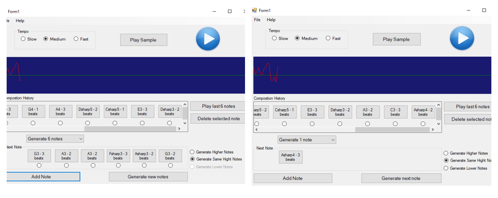

# Music Composer 
Music composing windows forms application to be tested and used by non-musicians.  <br/> 
Project by: Martina Boshkovska and Ilija Vishinov

## 1. Description of the problem and the application

The idea behind the application is to see if people that have no musical background are able to create music that sounds good, to them and to other people.This application is therefore primarily intended for use by non-musicians, but it can also be interesting for use by musicians who are open to the idea of trying out how they can compose something one random note at a time. 

The application itself represents a simplified and easy to use music composer that lets the user compose a melody by choosing one note from 6 randomly generated notes or by choosing if one random note goes or not in the complete composition, one note at a time. He can also edit the composition (delete notes he has entered and later on doesn't like) and save it for further use.

## 2. Instructions for using the application

### 2.1 The composer

When starting a new game the user can immediately start composing. The default setting of the game shows 6 buttons with note names and duration written on them **(Picture 1)**. By clicking on each button the user can hear the represented note. Then if the user likes one of the notes he can add that note to his melody by selecting the accompanying radiobutton (below each button) and clicking on the button **Add Note**. After each note added, there are new 6 notes generated and displayed on the form, and the previously added note is vissible in the **Composition History Panel** **(Picture 2)**. If the user does not like the notes, he can generate 6 new notes by clicking on **Generate New Notes**. 
By selecting the radioButtons **Generate Higher Notes** or **Generate lower Notes**, from that point on, the generated notes will accordingly be one octave  higer or lower than the standard octave.


After inserting notes in the melody the user can listen to the whole melody by clicking the prominent **Play** button on the upper right of the Form. There are three options for the tempo in which the composition will be played: **Slow**, **Medium** and **Fast**. These can be selected by the user on the upper left of the application window **(Picture 1)**.

The composition history panel allows the user to listen to every previously inserted note and decide if he wants to delete it or leave it in the composition. He does so by selecting the corresponding radioButton and pressing the **Delete Selected Note** button on the right side of the panel.

At any given moment while the application is running, there is also an area that gives a visual representation of the melody that has been composed **(Picture 2)**.



If the user wishes to have one note generated at a time, and decide if that note goes or not into his created composition, he can do so by choosing the option "Generate 1 note" from the **Combo box** displayed above the **Next Note** panel. From that moment on, the application has the appearance as displayed on the right of **Picture 2**. Naturally, the user can transfer back to generating 6 notes each time, by selecting "Generate 6 notes" from the same combo box component.

### 2.2 Saving composition 

For allowing the user to Save the composition, we have implemented **Save** and **Save as..** menu items in the menu strip under the File Section. The game can be saved with the extension: **\*.cmf**


### 2.3 Loading composition

For loading a composition that has been previously composed, the user can use the **File->Open** option from the menu.


### 2.4 New Composition

For starting a new composition, the user can choose **File -> New** opton from the File menu.

### 2.5 Instruction manual 
If the user has need at any moment to read instruction about the application, he can open the instruction manual by going to the **Help** menu item and clicking on  **Instructions**.


## 3. Problem implementation

For the developing of the application the [midi-dot-net library](https://github.com/jstnryan/midi-dot-net) which is an open source music library for C#,  was used. The library offers more functions that are useful for creating and playing certain music sounds. The packages from the library were first [installed](https://www.nuget.org/packages/midi-dot-net/) using the NuGet Package Manager in Visual Studio and were included in the Form.cs file and all custom made classes with the directive 
`using Midi;`


### 3.1 Classes and Data Structures Used

The main data for the application are in the `public class MyComposition` and the main program logic is in the `public partial class Form1 : Form`. 

Inside of `public class MyComposition` the following structures are stored:
```java
        private List<MyNote> notes; // the list of added notes (the composition itself)
        private int position; // current position where next note will be added
        private int tempo;  // beats per minute
        private int totalDuration; // in milliseconds
        private int beatLength; // in milliseconds
```
The class `MyNote` is a custom class in which information about every note are stored for use by the methods in the midi-dot-net classes (velocity, pitch and duration).

The data structures used through the application are lists, enums, integers and floats.


### 3.2 Main program logic

The main logic of the game is to allow the user to choose notes to add to a composition, edit the notes added, listen to the composition, as well as save and open compositions.

#### 3.2.1 Random Note Generating

The starting point of the application generates 6 random notes using the `generateNotes()` function which uses the following code snippet to create a note :
```java
            int notePitch = random.Next(octave, octave + 12);
            int beatsDuration = random.Next(1, 4);
            MyNote toAddNext = new MyNote(notePitch, beatsDuration);
            generatedNotes.Add(toAddNext); 
            btnN1.Text = toAddNext.ToString();
            
           /*the code replicates for each of the six buttons in the Next Note section of the application*/

```

Octave is the music octave from which the notes will be created. By default, it is set to the fourth octave, but the user can raise it to one higher or lower. **generatedNotes** is a list that consists of the generated notes and is used to manage the addition of a user selected note to the composition. In `MyNote` class, the **toString()** method uses an enum structure to translate each generated note into readable form.

After each note is added, or the user clicks on  **Generate New Notes**, the `generateNotes()` method is invoked.

#### 3.2.2 Playing melody
The user plays the melody by clicking on the **Play** button. On this click the tempo of the composition is set and then the `play()` method from `MyComposition` is called. The method is given as follows. 

```java
        // schedules the notes and plays the composition
        public void play(OutputDevice outputDevice)
        {
            new Thread(() =>
            {
                Clock clock = new Clock(tempo);
                foreach (MyNote n in notes)
                {
                    totalDuration += n.myDurationInBeats * beatLength;
                    clock.Schedule(n.noteStart(outputDevice, position));
                    position += n.myDurationInBeats;
                    clock.Schedule(n.noteEnd(outputDevice, position));
                }
                clock.Start();
                Thread.Sleep(totalDuration + 1000); // 1 additional second
                clock.Stop();
                
            }).Start();
        }
```

The implementation of the method uses the class `Midi.Clock` to schedule the notes along with their duration and then play them. This is done in a separate thread because of the `Thread.Sleep` method that would otherwise block the whole application until the melody stops.

#### 3.2.3 Composition History Management

To display every note of the composition history and be able to hear to each chosen note separately or delete notes, the **Add Note** button, and the **Delete Selected Note** button invoke the `fillPanel()` function in the `Form1.cs` file. 

For displaying every note as a button and an accompanying radioButton, a `public class Components` was created. This class stores two class variables, both of type `System.Windows.Forms.Control`, one of which is a Button, and the other a radioButton.

The `fillPanel()` function iterates through the composition and for every note creates an object of class Components, setting the values for its variables, and setting the component's  **Tag** property to the index of the note in the composition array (this is used when deleting the notes). It also adds a click event to every button:

```java
button.Click += (s, e) => {
                    MyComposition comp = new MyComposition(formTempo);
                    comp.addNote(n);
                    comp.play(outputDevice);
                };
```

The event is used to play every note when clicking on the button. After doing this the function adds the controls to the **Composition History Panel** and sets the newest added note always in view ( by setting properties on the Horizontal Scroll Bar on the panel)

When the `Delete Selected Note` button is clicked the following code finds the selected element, reads the Tag of the radioButton and deletes that index from the main composition, and calls `fillPanel()` anew.

```java
var checkedButton = panel1.Controls.OfType()
                                       .FirstOrDefault(r => r.Checked);
            composition.removeAt((int)checkedButton.Tag);
            fillPanel();
```

#### 3.2.4 Visual representation of the composition

For the visual representation a **PictureBox** element is used, on which Pens of colors green and red represent the pitch of the notes in the composition by drawing lines.

For the **PictureBox** the **Paint** event  is implemented, a Double Buffer is used to enhance performance and by calling the `Invalidate()` method on the **PictureBox**, the **Paint** method is invoked every time a new note is added or deleted, a new file is created or an existing one is loaded.

### 3.3 Serialization

For the purposes of further use of the composed music and opening existing files, all custom classes are notes as `[Serializable]` and with the use of binary serialization and deserialization and file management the state of an existing program is saved and/or can be restored.

The `Serialize()` and `Deserialize()` methods are called on an `IFormatter` object of type `BinaryFormatter` and are used to serialize and deserialize the composition.

After deserialization, other data dependent components or methods have to be called on the newly deserialized composition, to restore the exact previous state of the Windows Forms application.

### 3.4 User Interface

For creating the user interface of the application, various components have been used. 

The dominant colors of the application are grey and MidnightBlue, where red and green are used for visualization of the melody. 
For representation of the notes, a **Button** and a **RadioButton** is used for each note. 
For adding, removing, generating new notes and deleting selected notes buttons are used.
Radio buttons are used to select the tempo in which the composition will be played, or the higher or lower octave preferences.

**Group box** elements are used to group the tempo selection controls, and the **Next Note** components. This is necessary because the radio buttons in these section should be used as connected within the sections, but independently between different sections. 

For the **Play** button and the visual representation, **PictureBox** components are used.

The **Composition History** component is of type **Panel** which enables the automatic scroll properties, that are of great use for dynamic insertion of elements.

A **MenuStrip** component is also used for the implementation of **File** and **Help** menus.

All the components can be seen in Picture 2.

## 4. System Requirements and functionality warranty

For the use of this application, the user has to have a **MIDI** output device on his computer.
The application has been developed in **Visual Studio 2017** and we make no assumptions of its proper functioning on other versions of VS.
