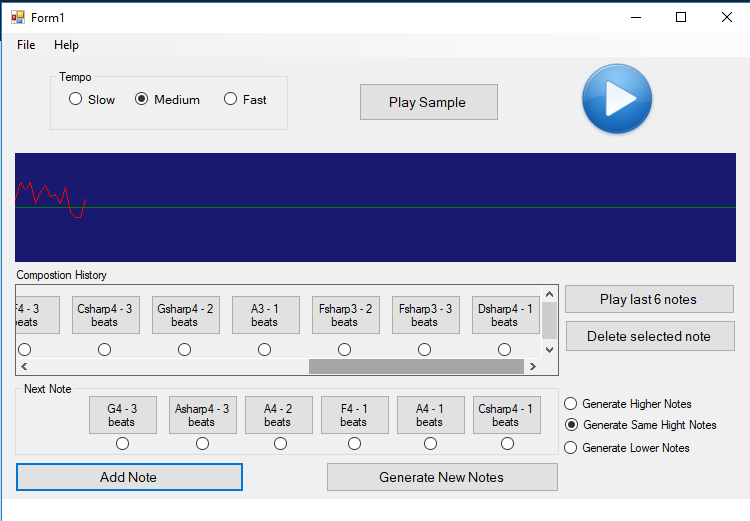

# Music Composer 
Music composing windows forms application to be tested and used by non-musicians.    
Project by: Martina Boshkovska and Ilija Vishinov

## 1. Description of the problem and the application
The idea behind the application is to see if people that have no musical background are able to create music that sounds good, to them and to other people.This application is therefore primarily intended for use by non-musicians, but it can also be interesting for use by musicians who are open to the idea of trying out how they can compose something one random note at a time. 

The application itself represents a simplified and easy to use music composer that lets the user compose a melody by choosing one note from 6 randomly generated notes or by choosing if one random note goes or not in the complete composition, one note at a time. He can also edit the composition (delete notes he has entered and later on doesn't like) and save it for further use.

## 2. Instructions for using the application

### 2.1 The composer

When starting a new game the user can immediately start composing. The default setting of the game shows 6 buttons with note names and duration written on them **(Picture 1)**. By clicking on each button the user can hear the represented note. Then if the user likes one of the notes he can add that note to his melody by selecting the accompanying radiobutton (below each button) and clicking on the button **Add Note**. After each note added, there are new 6 notes generated and displayed on the form, and the previously added note is vissible in the **Composition History Panel** **(Picture 2)**. If the user does not like the notes, he can generate 6 new notes by clicking on **Generate New Notes**. 
By selecting the radioButtons **Generate Higher Notes** or **Generate lower Notes**, from that point on, the generated notes will accordingly be one octave  higer or lower than the standard octave.

After inserting notes in the melody the user can listen to the whole melody by clicking the prominent **Play** button on the upper right of the Form.

The composition history panel allows the user to listen to every previously inserted note and decide if he wants to delete it or leave it in the composition. He does so by selecting the corresponding radioButton and pressing the **Delete Selected Note** button on the right side of the panel.

At any given moment while the application is running, there is also an area that gives a visual representation of the melody that has been composed **(Picture 2)**.

### 2.2 Saving composition 

For allowing the user to Save the composition, we have implemented **Save** and **Save as..** menu items in the menu strip under the File Section. The game can be saved with the extension: **\*.cmf**

### 2.3 Loading composition

For loading a composition that has been previously composed, the user can use the **File->Open** option from the menu.

### 2.4 New Composition

For starting a new composition, the user can choose **File -> New** opton from the File menu.

## 3. Problem implementation

